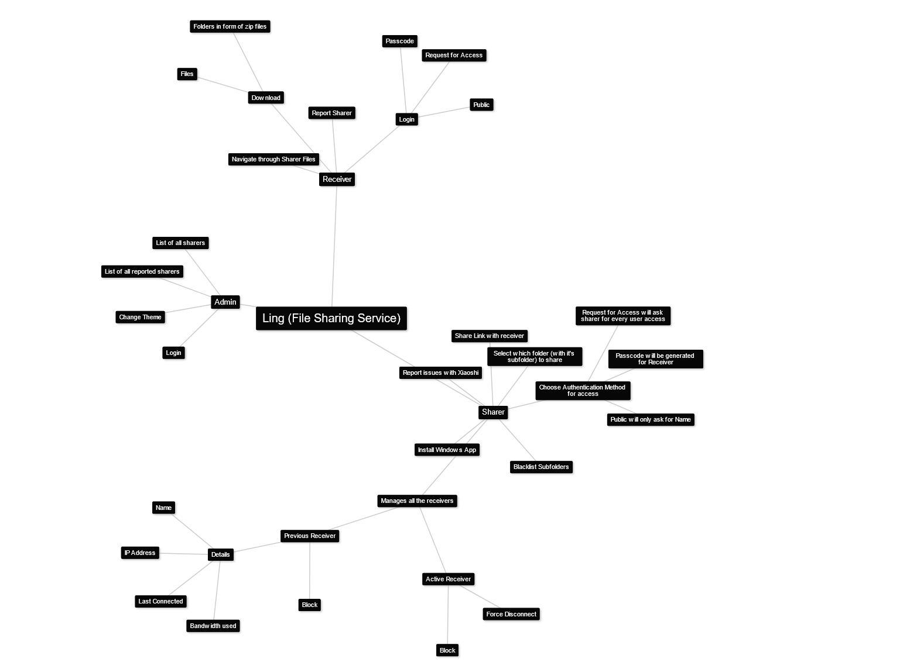

# Introduction
## Technologies used
- .Net Framework 4.7 (C# 7.3)
- MS SQL
- Windows Form
- ASP.Net
- WebSocket

# System Specification
## Role of every Application
### Web App
- Shows all the files being shared by sharer.
- Asks user for authentication with the sharer selected method.
- Generates Link for every sharer and store them into the DB with their MAC address for identity.
- Manages Websocket Connection. (Creates when needed and Closes when not Needed).
- Redirects user to sharer's HTTP server for file downloads.
= Option to Report the sharer.

### Windows Form
- Indexes the sharer's file System. (Plan to replace this "idea" with more memory efficient one).
- Remove sBacklisted folder/files from the index.
- Sends File System Updates to Web App for live View using WebSocket.
- Keep eyes on the public ip of system (Not sure if public ip can even changed by ISP when HTTP server is running).
- Zip the folder when user requests for folder download.
- Option to report an issue related to Windows App.

### Admin Panel
- Can look at List of all the sharers and report sharers.
- Can Forcefully disconnect a sharer.
- Can ban a sharer permanently from service.
- Can Join server link without their permission (For Investigation purpose).

## FlowChart

## MindMap

## Why
SFTP is secure and reliable but also hard to setup.

## References
- Logo :- https://iconsmind.com/ ([License Info](https://www.iconarchive.com/show/outline-icons-by-iconsmind/Cat-icon.html))
- Dotnet Documentation : https://learn.microsoft.com/en-us/dotnet/api/